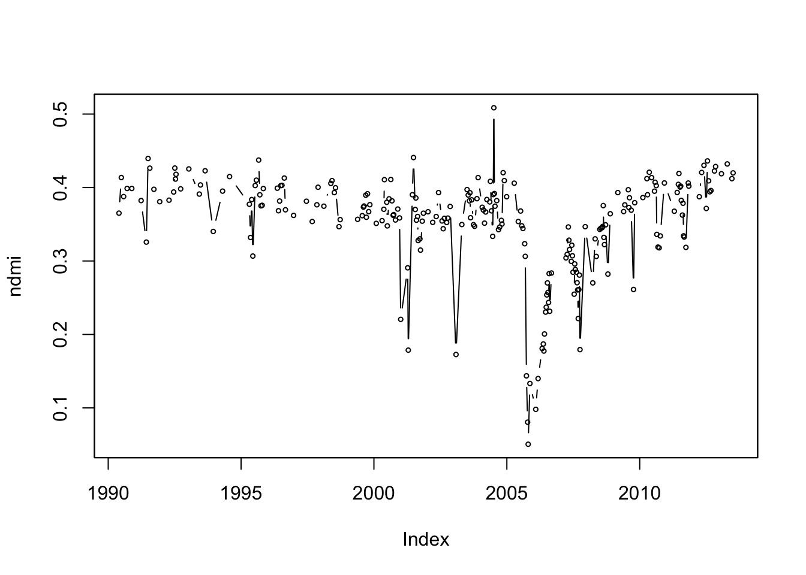
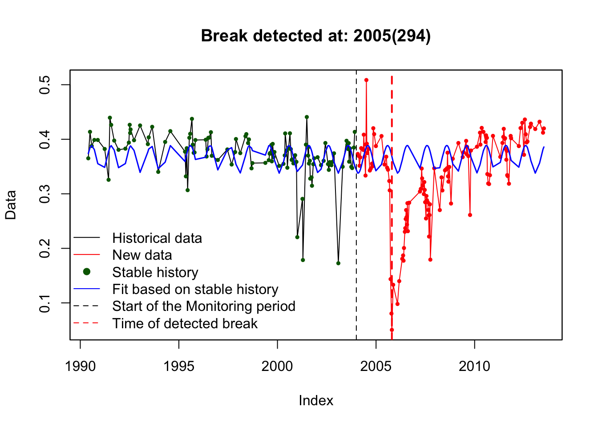
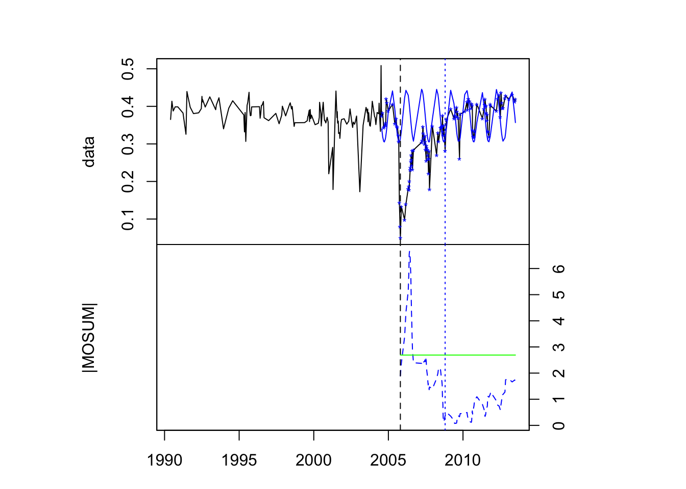
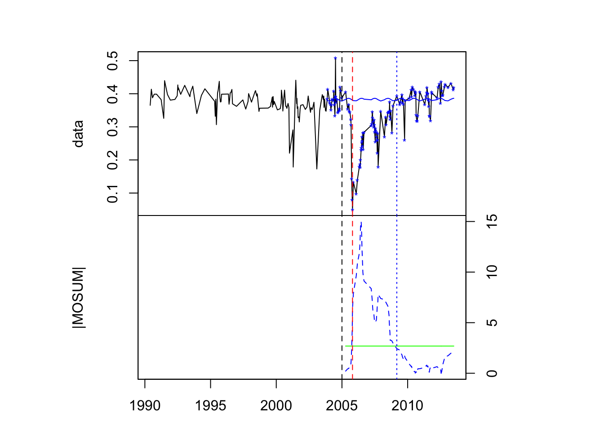
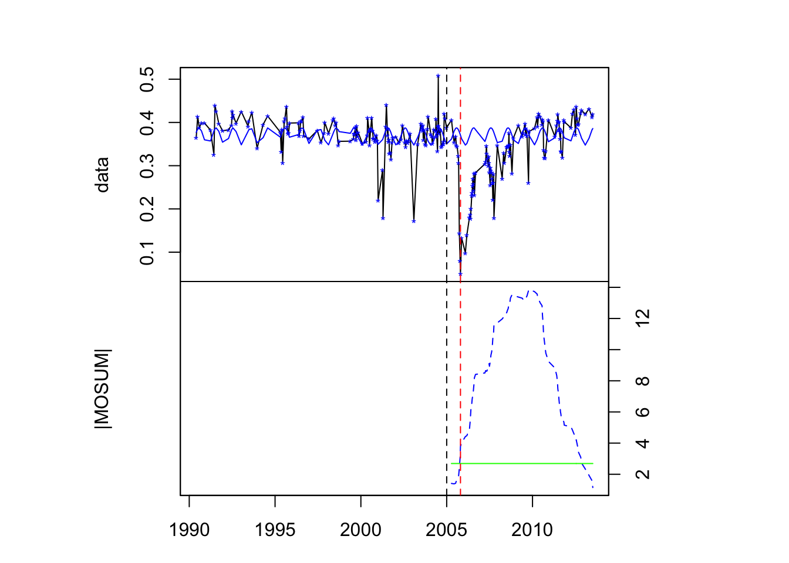
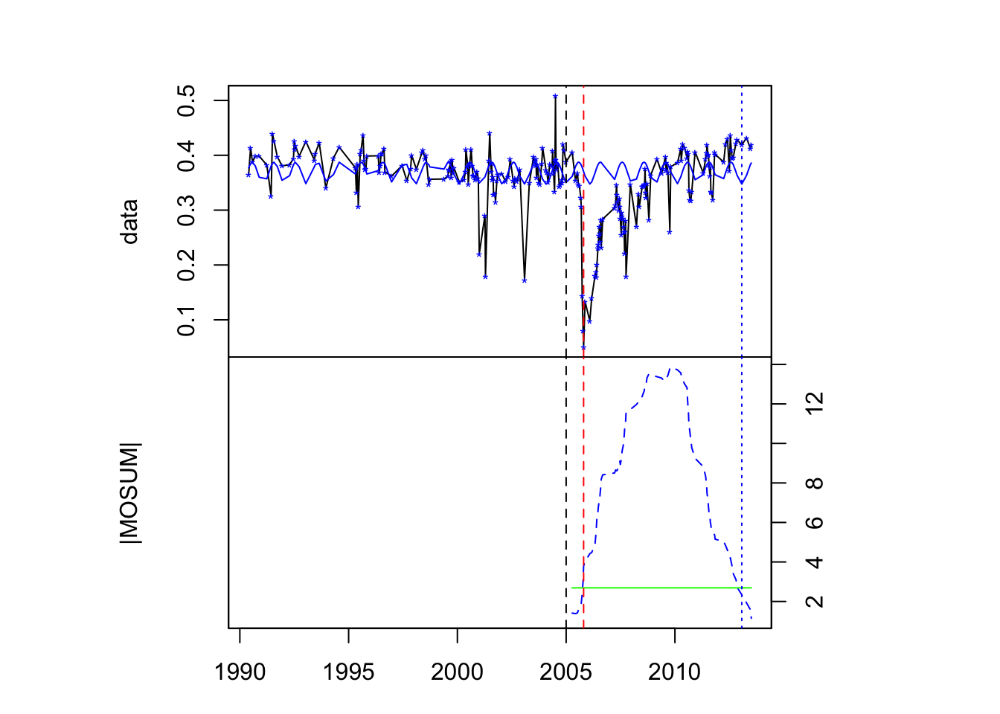

<script type="text/x-mathjax-config">
    MathJax.Hub.Config({
      jax: ["input/TeX", "output/HTML-CSS"],
      tex2jax: {
        inlineMath: [ ['$', '$'] ],
        displayMath: [ ['$$', '$$'], ["\[", "\]"] ],
        processEscapes: true,
        skipTags: ['script', 'noscript', 'style', 'textarea', 'pre', 'code']
      }
      //,
      //displayAlign: "left",
      //displayIndent: "2em"
    });
</script>
<script src="http://cdn.mathjax.org/mathjax/latest/MathJax.js?config=TeX-AMS_HTML" type="text/javascript"></script>

`rgrowth` is an R package for monitoring disturbance-regrowth dynamics in forests using Landsat time series (LTS) data. This package requires the [bfastSpatial](http://github.com/dutri001/bfastSpatial) package. See the bfastSpatial tutorial for more info on how to download, pre-process and run `bfastmonitor()` on LTS data.

## Installing rgrowth

Installing `rgrowth` in R is very easy - first install the `devtools` package (if you haven't done so already). If you haven't worked with bfastSpatial yet, you will have to install it from github first and then install `rgrowth` via github and load.

```r
library(devtools)
install_github('dutri001/bfastSpatial')
install_github('bendv/rgrowth')
library(rgrowth)
```

## Landsat time series (LTS)

After installing and loading `rgrowth`, load the *ndmi* dataset.

```r
data(ndmi)
```

This is a time series of the Normalized Difference Moisture Index (NDMI), derived from all Landsat data with cloud-cover percentage lower than 80% over a site in Madre de Dios, a tropical forest system in south-eastern Peru. NDMI is the normalized difference between the first short-wave infrared (SWIR1) band and the near infra-red (NIR) bands.

$$ NDMI = \frac{NIR - SWIR1}{NIR + SWIR1} $$

NDMI is sensitive to moisture content in vegetation, which makes it a better index for monitoring forest regrowth than NDVI, because it is more senstivie to canopy dynamics. *ndmi* was saved as a `zoo` object -- an order vector with a time index.

```r
class(ndmi)
summary(ndmi)
plot(ndmi, type = 'b', cex = 0.5)
```

{:width="600px"}

## bfastmonitor: detecting disturbances

From the plot above, it is obvious that there was a disturbance in this time series in 2005. We can automatically detect this disturbance using `bfastmonitor()` from the [bfast](http://bfast.r-forge.r-project.org) package. First, we make the time series into a 'regular' time series, by filling in missing dates with `NA` values. Then we run `bfastmonitor()` using a preset monitoring period to detect the break.

```r
bts <- bfastts(ndmi, dates = time(ndmi), type = 'irregular')
bfm <- bfastmonitor(bts, start = c(2004, 1), formula = response~harmon, order = 1, plot = TRUE)
print(bfm)
```

{:width="600px"}

## tsreg: monitoring for post-disturbance regrowth

Using the breakpoint attribute of our result, we can monitor for post-disturbance regrowth -- interpreted from the recovery (or not) of the spectral signal after the disturbance compared to the model derived from the history period.

```r
reg <- tsreg(ndmi, change = bfm$breakpoint, h = 0.5, plot = TRUE)
```

{:width="700px"}

The default start of the monitoring period was set to the break date (from `bfastmonitor()` above), and the history model was determined automatically as a 'stable' portion of the time series preceding that date. If our break date is slightly delayed, we can introduce noise (from the disturbance) to our fitted model. The `startOffset` argument can prevent that. This can be set to an integer (start of monitoring period in years prior to change), or it can be set to `"floor"`, which will set it to the floor of the original change year (e.g. if the change was in 2005.500 -- half way through the year, the monitoring period is set to 2005).

```r
reg2 <- tsreg(ndmi, change = bfm$breakpoint, startOffset = "floor", h = 0.5, plot = TRUE)
```

{:width="700px"}

Note that when the start date and the change date are different, the change (breakpoint) is plotted as a dotted red line in addition to the start of the monitoring period (black dotted line). So, in this case, we have a better fitted model, and a more realistic regrowth detection (dotted blue line).

`tsreg()` returns an object of type `tsreg` -- it is simply a list of output parameters that can be used to judge whether or not regrowth has occured or not. Retrieve these simply by using `print()`

```r
print(reg2)
```

Note in the plot above that the model only included a very small portion of the historical data, and successfully avoided the outlier observations in the fitting procedure. If we had used all data in our history model (by setting `history = 'all'`), the noise component in the model would have been much larger, which has an effect on the MOSUM values.

```r
reg3 <- tsreg(ndmi, change = bfm$breakpoint, startOffset = "floor", h = 0.5, history='all', plot=TRUE)
```

{:width="700px"}

In this case, the MOSUM values take much longer to reach the critical boundary again. But why is there no regrowth flag when the MOSUM clearly crosses back below the boundary at the end of the time series? This is because we set (by default) the value of the post-regrowth stability criterion (`s`) to 1 year. Suppose we relax that to 0 years (ie. no such criterion).

```r
reg4 <- tsreg(ndmi, change = bfm$breakpoint, startOffset = "floor", h = 0.5, history='all', s=0, plot=TRUE)
```

{:width="700px"}

In this case, regrowth is flagged at the cross-over point with no consideration for whether this return is ephemeral or not.

## References

DeVries, B., M. Decuyper, J. Verbesselt, A. Zeileis, M. Herold and S. Joseph. 2015. Tracking disturbance-regrowth dynamics in the tropics using structural change detection and Landsat time series. *Remote Sensing of Environment* 169:320-334. DOI: [10.1016/j.rse.2015.08.020](http://doi.org/10.1016/j.rse.2015.08.020).

Verbesselt, J., A. Zeileis and M. Herold. 2012. Near real-time disturbance detection using satellite image time series. *Remote Sensing of Environment* 123:98-108. DOI: [10.1016/j.rse.2012.02.022](http://doi.org/10.1016/j.rse.2012.02.022).
